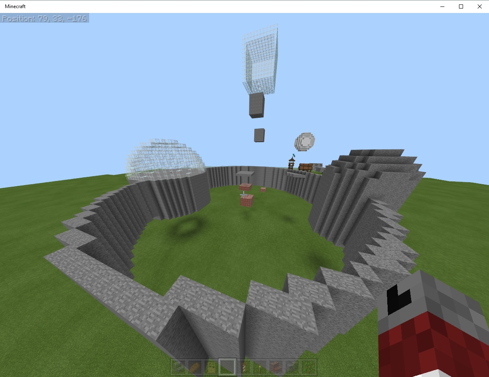
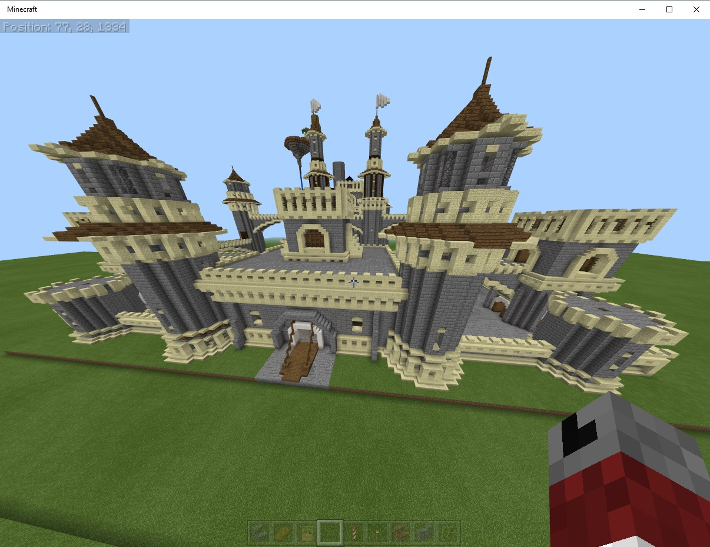

# Minecraft World Edit for Windows 10 Bedrock Edition

This is a program that adds World Edit capabilities inside Minecraft. Specifically, it allows you to do three types of operations in the game:
1. Create geometry in the game. ie Walls, Floors, Boxes, Circles, Rings, and Spheres
2. Save a list of positions(coordinates) in the game so that you can run mulitple create commands on the same coordinate.
3. Imports Java Edition Schematics into the game.

## What can it do?
Create geometry

Import Schematics

## How to Use
| Command | Subcommand | Arguments | Description | Example |
|---------|------------|-------------|---------|---------|
|/pos         | add          | name  | Adds the players currect position(coordinates) under the name specified.        | |
|/pos         | list         |       | Lists the names and coordinates ( X , Y , Z) of all saved positions.    |  |
|/pos         | remove       | name  | Removes the stored position by it's name.        | |
|||  || |
|/create      | box     | width length height block |         | |
|/create      | box     | width length height block position|         | |
|/create      | box     | width length height block x y z|         | |
|/create      | walls  | width length height blockname |         | |
|/create      | walls  | width length height blockname position|         | |
|/create      | walls  | width length height blockname x y z|         | |
|/create      | floor   | width length blockname             |         | |
|/create      | floor   | width length blockname position            |         | |
|/create      | floor   | width length blockname x y z            |         | |
|/create      | outline | width length height blockname|         | |
|/create      | outline | width length height blockname position|         | |
|/create      | outline | width length height blockname x y z|         | |
|/create      | circle  | radius height blockname   |         | |
|/create      | circle  | radius height blockname position            |         | |
|/create      | circle  | radius height blockname x y z        |         | |
|/create      | ring | radius height blockname |         | |
|/create      | ring | radius height blockname position |         | |
|/create      | ring | radius height blockname x y z |         | |
|/create      | sphere | radius blockname |         | |
|/create      | sphere | radius blockname position |         | |
|/create      | sphere | radius blockname x y z |         | |
|   |           |             |         | |
|/schematic   | list          |             |         | |
|/schematic   | analyze | name             |         | |
|/schematic   | import | name x y z rotation shiftX shiftY shiftZ  |         | |

## Install
1. Download worldedit from [releases](https://github.com/The-HeX/mcpe-geometry-generator/releases)
2. Run WorldEdit.exe
3. From within a minecraft chat window type /wsserver 127.0.0.1:12112 
4. Start using the commands.

Optionally: there is an integration which uses the EDU Code Connection to talk with bedrock, but current the plugin does not require this. 
1. Download Minecraft Code Connection from microsoft. ( https://aka.ms/meeccwin10 )

